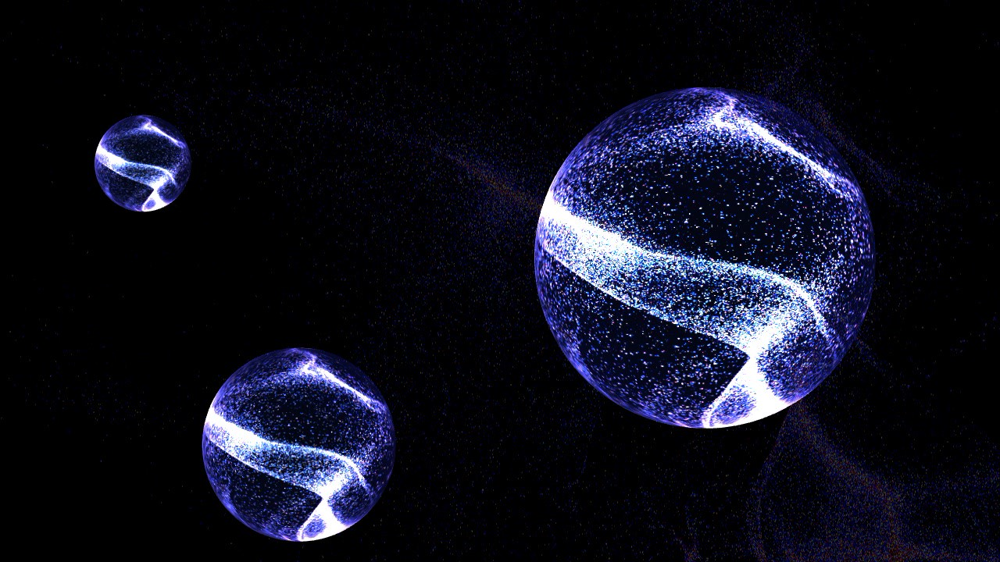

# Particle Play

Particle Play is a spectacular display of audio-reactive dispersed particles dancing to an eerie note. Inspired by the endless assymetric cosmos and its supposed strange tune that makes it mysterious and ethereal.

  
Developed in *TouchDesigner*.  
Music by [Dead Currents](https://www.youtube.com/watch?v=oBFekhDmhEE).  
Please use earphones in a dim lit room for the full experience.
> .Toe file contains the project and .mov file is the final product. 

